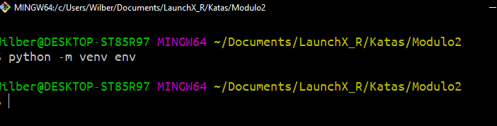
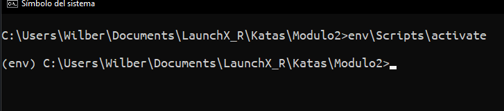
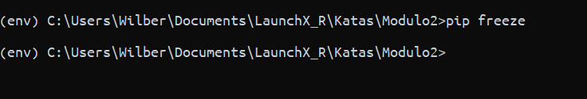
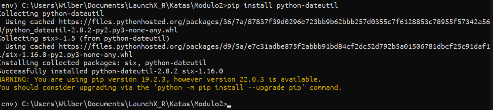
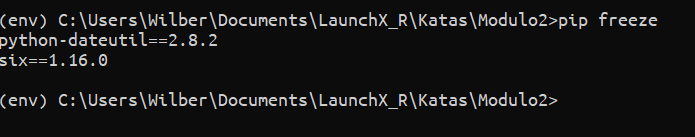
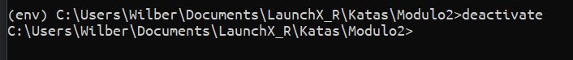

# Ejercicio - Crear un paquete

## Crear un entorno virtual

1. Ejecutar en su terminal: python3 -m venv env o bien python -m venv env

    
2. Ejecuta el comando para activar el entorno virtual: source env/bin/activate

    

## Instalar una biblioteca

1. Ejecuta el comando pip freeze para ver las bibliotecas instaladas en tu entorno:

    
2. Ejecuta el comando pip install para instalar una biblioteca:

    
3. Vuelve a ejecutar pip freeze para ver cómo ha cambiado tu lista de bibliotecas:

    

## Desactivar un entorno virtual

1. Ejecuta el comando deactivate:

    